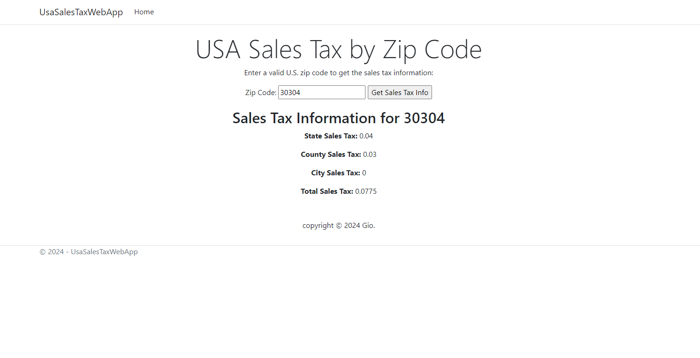

# USA Sales Tax Web App

## Overview
I created this model as a web-based tool that allows users to retrieve real-time sales tax information by entering U.S. zip codes (I originally intended it to be used to retrieve crypto tax rates). This app utilizes the RapidAPI's [U.S.A Sales Tax Per Zip Code API](https://rapidapi.com/perodriguezl/api/u-s-a-sales-taxes-per-zip-code/playground/apiendpoint_ab28f165-0435-43c6-9ad8-c0911628ca3b)
 to automatically pull accurate and up-to-date tax rates, including state, county, and city tax rates. 

This project can be a valuable tool for accounting firms looking to streamline and potentially automate tax calculations! I believe that automation tools like this can help hundreds of accounting firms! I created this as a web app for demonstration purposes, but in practice I would turn it into a standalone application to possibly integrate it with a database backend for client based calculations (such as automating the completion of tax forms).
## Features
- **Real-Time Tax Rate Retrieval**: Automatically pulls state, county, and city tax rates based on zip code.
- **Improved Accuracy**: Reduces human error by automating tax rate updates.
- **Seamless Integration**: Can be integrated with other accounting tools to simplify tax calculations.
- **Efficiency for Multi-State Businesses**: Allows firms to quickly retrieve and apply tax rates for clients operating in different locations.

## GUI Screenshot
Here’s the current gui web app:



## How This Helps Accounting Firms
- **Real-Time Accuracy**: No need for manual updates of tax rates, ensuring the latest tax laws are applied.
- **Streamlined Tax Preparation**: Automatically integrates tax rate calculations into workflows, speeding up tax filings.
- **Advisory Services**: Provides tax planning insights with the latest local tax rates, improving client advisory services.
- **Audit and Compliance**: With tax rates being pulled directly from a reliable source, firms can confidently provide accurate tax filings and documentation.
- **Efficiency and Cost Savings**: Reduces the need for manual labor, allowing firms to focus on higher-value tasks and client services.
- **Multi-State and Local Tax Solutions**: Particularly beneficial for businesses operating in multiple states or localities, where tax rates differ significantly.

## Installation
(You will need your own api-key)

1. **Clone the Repository**:
   ```bash
   git clone https://github.com/yourusername/usa-sales-tax-webapp.git
   cd usa-sales-tax-webapp

2. **Install Dependencies**:
Ensure you have ASP.NET Core installed on your machine.

  ```bash
  dotnet restore
  ```
3. **Run the Application**:
You can launch the application using the following command:
  ```bash
  dotnet run
  ```
## Access the Application
Open your browser and navigate to [http://localhost:5250](http://localhost:5250).

## Usage
- Enter a valid U.S. zip code into the input field.
- Click the "Get Sales Tax Info" button.
- View the state, county, city, and total tax rates displayed on the page.

## Technologies Used
- **C#**: Backend language for logic and API integration.
- **ASP.NET Core Razor Pages**: Web framework for building the frontend interface.
- **Bootstrap**: For responsive design and layout.
- **RapidAPI**: API for retrieving sales tax information.
- **Newtonsoft.Json**: For JSON deserialization of API data.

## API Integration
This app integrates with the U.S.A Sales Taxes Per Zip Code API from RapidAPI. It pulls real-time tax data based on user input (zip code) and displays it on the web app.

## Contributing
This was an economics project for a class of mine and the concept isn't new. If you want to use my framework please feel free to fork, and remember to connect it to your own api.

## License
copyright @2024 Gio
